# 🦺 NoHelmet — Real‑Time Helmet Detection (YOLO)

Real‑time helmet detection system based on **Ultralytics YOLO**, trained for construction‑site PPE monitoring.

**Features**
- Webcam (`--mode stream`) and video file inference (`--mode video`)
- Separate confidence thresholds per class (head vs helmet)
- GPU acceleration (CUDA)
- Optional frame skipping with non‑blinking boxes (simple track/hold logic)

---

## Project Structure

```text
NOHELMET/
├── inference.py          # Main inference script (webcam/video)
├── train.ps1             # Training script (PowerShell)
├── pps.yaml              # Dataset config
├── requirements.txt
├── DS/                   # Dataset (usually excluded from git)
├── runs/                 # Training outputs (Ultralytics default)
├── model/                # Training result images (plots + val previews)
└── weights/              # Trained weights (kept in git)
```

> If your training plots are not visible on GitHub, double‑check that the images are **committed** under `model/` and that the paths below match the repo structure exactly (case‑sensitive on Linux/GitHub).

---

## Installation

```bash
pip install -r requirements.txt
```

If you want GPU inference, install a CUDA‑compatible PyTorch build.

---

## Classes

- `0` → `head`
- `1` → `helmet`

---

## Training

### PowerShell example

```powershell
$MODEL = "yolo11n.pt"
$DATA  = "DS/pps.yaml"
$NAME  = "helmet_exp1"

yolo detect train `
  model=$MODEL `
  data=$DATA `
  imgsz=1280 `
  epochs=30 `
  device=0 `
  batch=96 `
  name=$NAME `
  project="DS/runs/train" `
  exist_ok=True
```

---

## Inference

### Webcam

```bash
python inference.py --mode stream --device 0
```

### Video

```bash
python inference.py ^
  --mode video ^
  --input ".\test_video\video.mp4" ^
  --output ".\output.mp4" ^
  --model "DS\runs\train\helmet_yolo26s_exp3_1280\weights\best.pt" ^
  --imgsz 1280 ^
  --head_conf 0.40 ^
  --helmet_conf 0.20 ^
  --iou_thr 0.10
```

---

## Key Parameters

- `--head_conf` : confidence threshold for **head**
- `--helmet_conf` : confidence threshold for **helmet**
- `--iou_thr` : IoU threshold for NMS
- `--imgsz` : inference resolution (e.g. 960/1280)
- `--skip_frames` : process every Nth frame (boxes held in between)

---

## Training Results

### Curves

| F1 | Precision | Recall | PR |
|---|---|---|---|
| 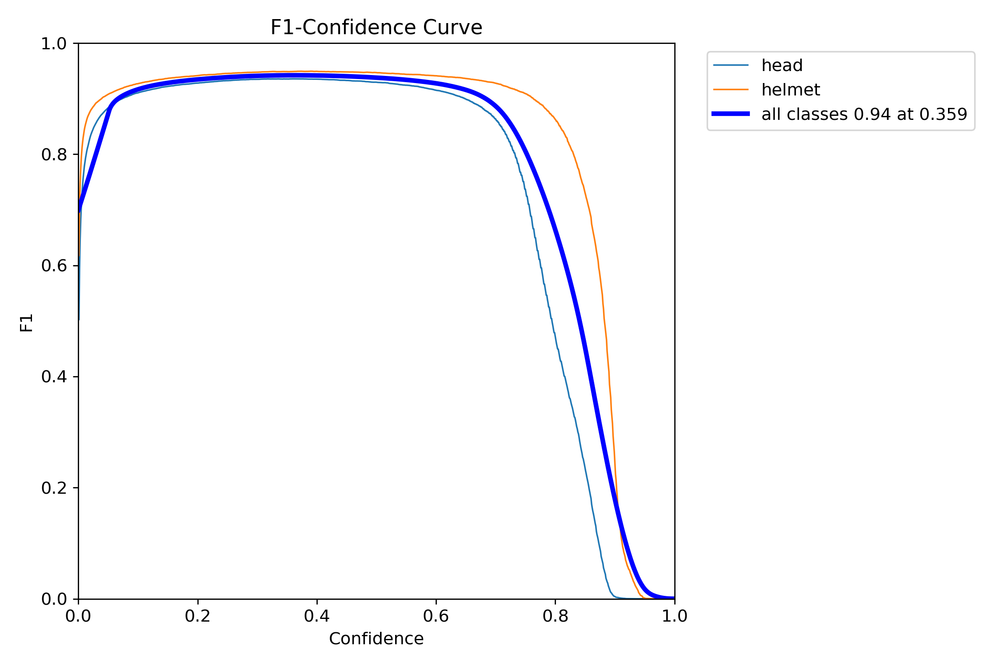 | 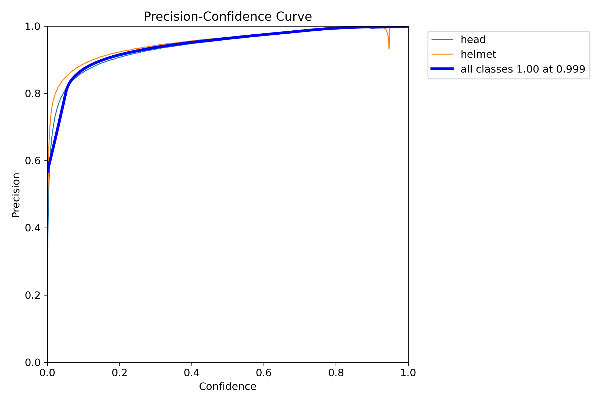 | 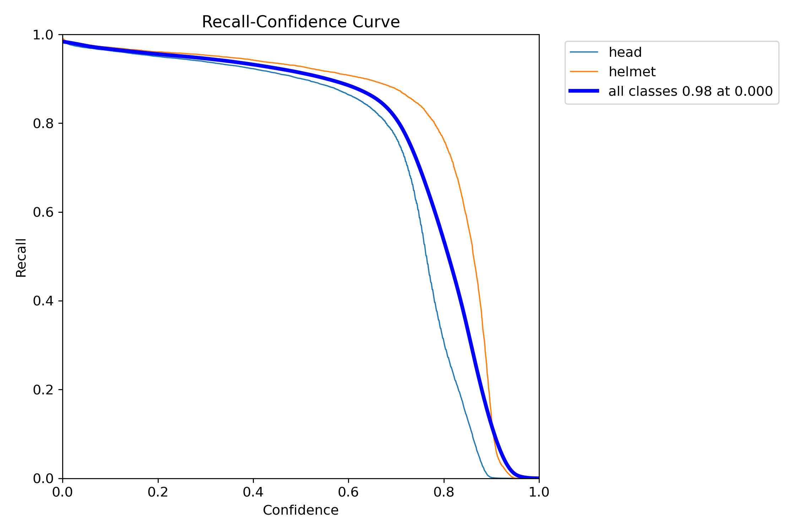 | 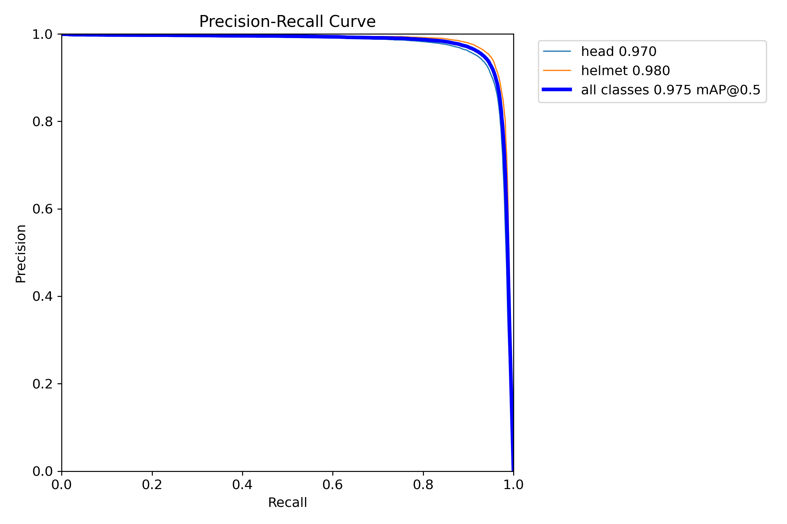 |

### Confusion Matrix

| Raw | Normalized |
|---|---|
| 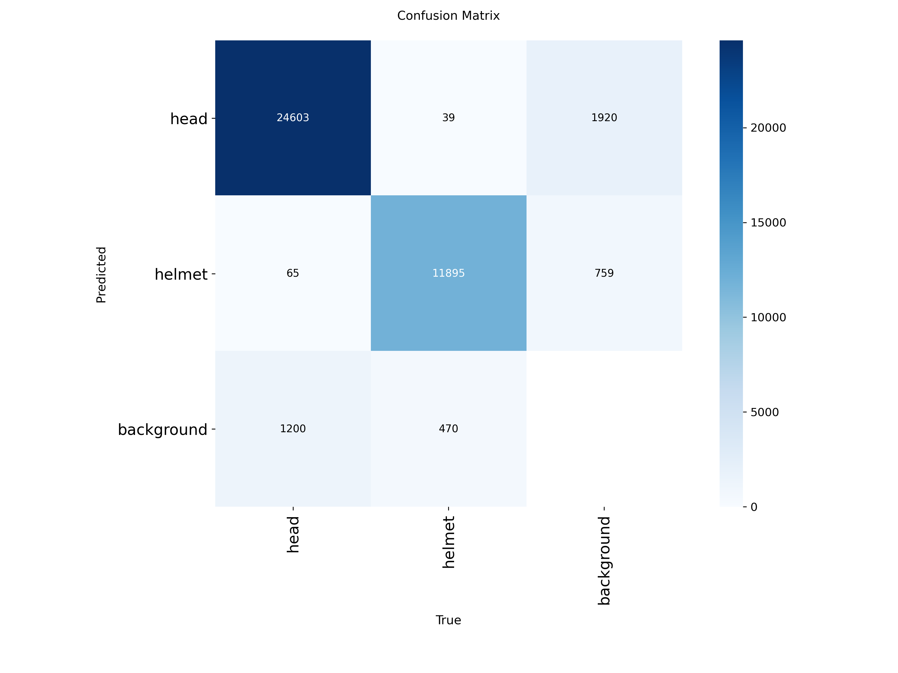 | 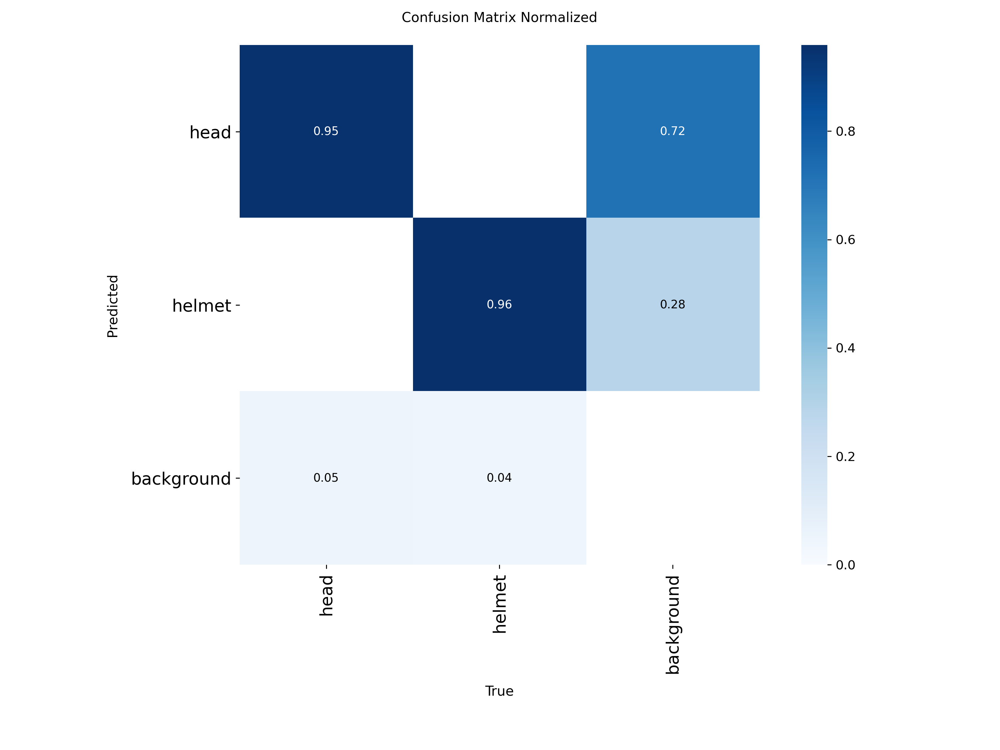 |

### Training Progress

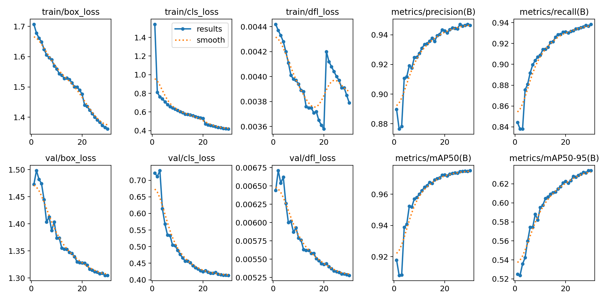

### Validation Previews

**Labels**
- 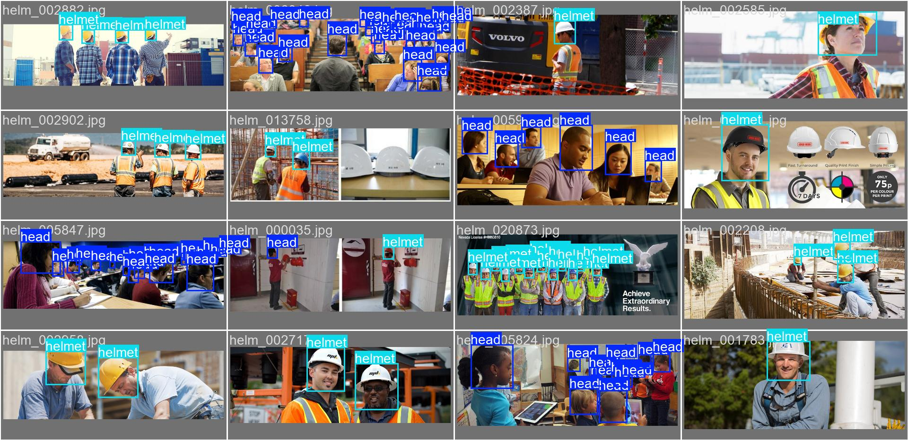
- 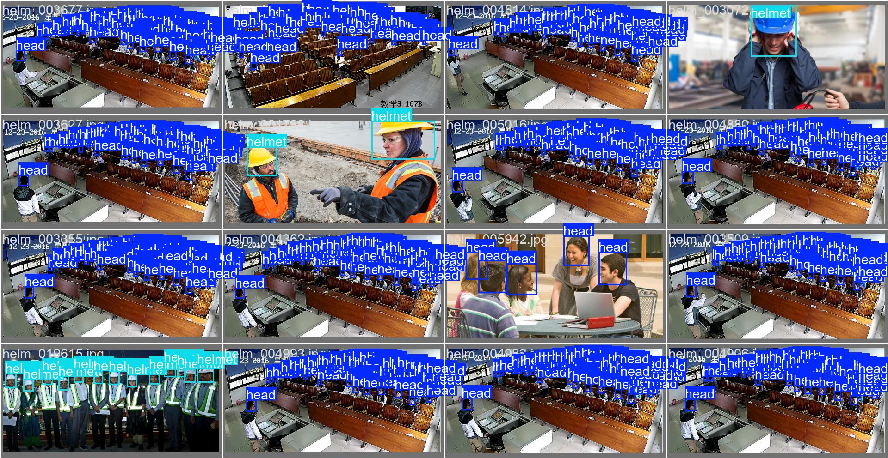
- 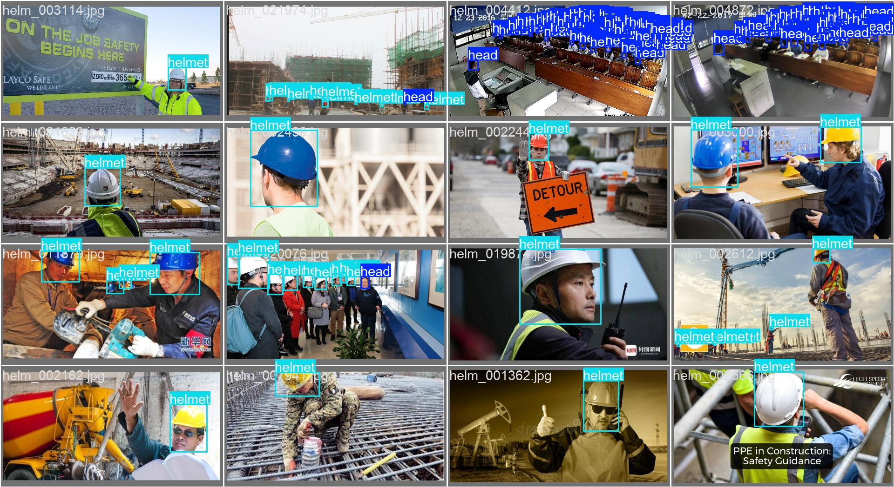

**Predictions**
- 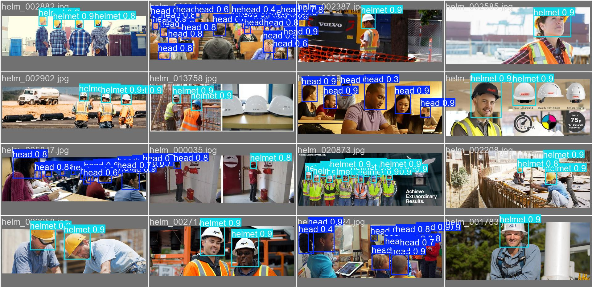
- 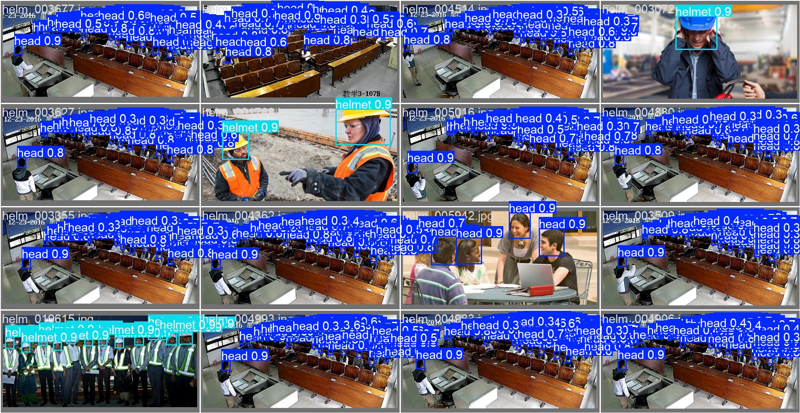
- 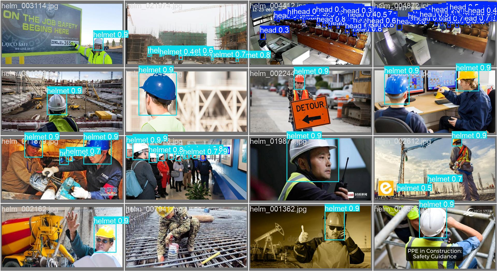

---

## Use Cases

- Construction site monitoring
- PPE compliance detection
- Industrial safety automation
- Smart surveillance systems

---

## Roadmap

- Add explicit `no_helmet` class (or post‑process head‑only detections)
- Better temporal smoothing / multi‑object tracking
- Multi‑scale training for improved distant shots
- RTSP / edge deployment
